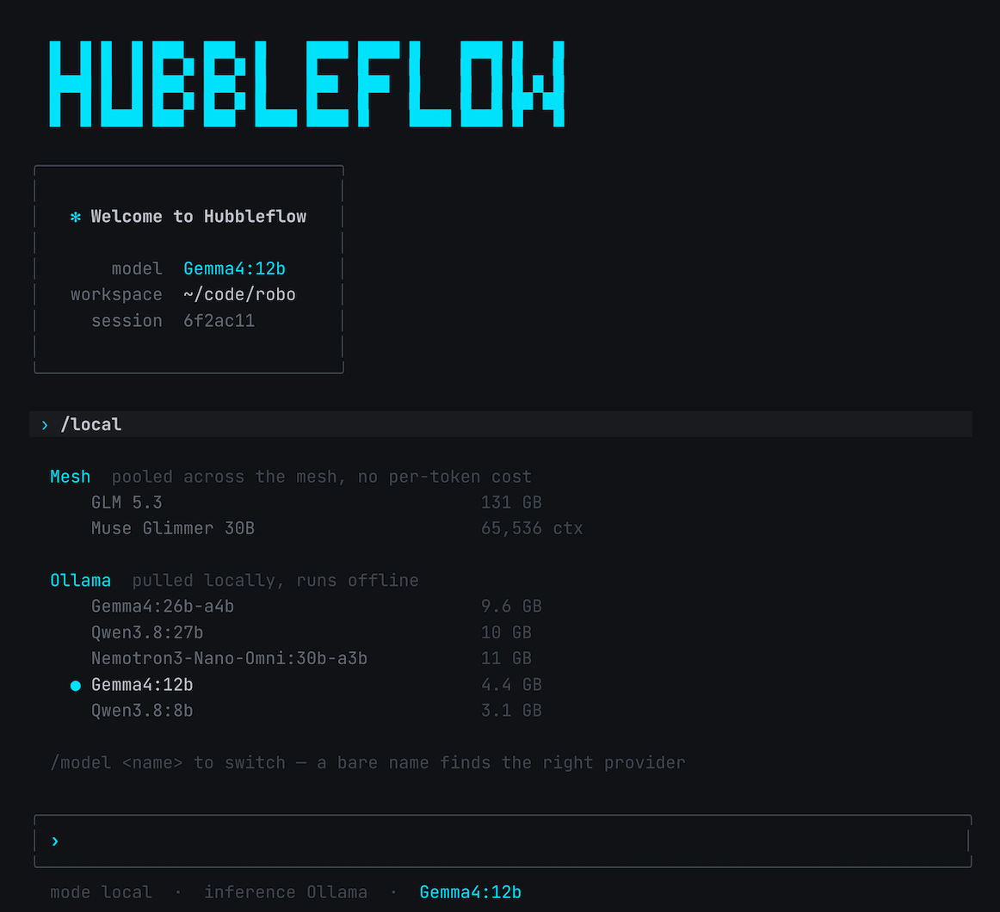

# Hubbleflow

[](https://github.com/hubbleflow-ai/hubbleflow-agent-harness/actions/workflows/ci.yml)
[](LICENSE)
[](https://www.python.org/downloads/)
[](tests/)

**A coding agent that runs on the GPU you already own.** No API key, no account.
Gemini and NVIDIA are available when you want them, never assumed.



`/local` above is the whole thing: models served from your own hardware,
discovered live, switched by name.

## Install

```bash
./install.sh          # macOS, Linux
.\install.ps1         # Windows
```

It installs [uv](https://docs.astral.sh/uv/) if you don't have it, puts
`hubbleflow` on your PATH, and fetches its own Python, so you don't need 3.13
installed first.

```bash
cd your-project
hubbleflow
```

That's it. Start `ollama serve` and your models show up on the next `/models`.

## Three things worth knowing

**It doesn't care whose model it is.** Seven providers (Ollama, vLLM,
llama.cpp, FreeToken, a Mesh node, Gemini and NVIDIA), each found by asking it
what it serves rather than reading a bundled list that goes stale. Type a bare
model name and the harness works out where that model lives.
→ [docs/models.md](docs/models.md)

**Caching that pays for itself, measured.** An agentic loop resends the whole
conversation every turn, so most of what you buy is tokens the model has already
seen. On a real session, **$0.0407 of input became $0.0089**: 92% served from cache,
net 78% cheaper after storage.
→ [docs/internals.md](docs/internals.md)

**Research that compounds.** `/deep-research` works a question over several
rounds and files the answer into a knowledge bundle, keeping the pages it
opened, the claims those pages support, and an honest expiry date. Ask again next week and it carries
the topic forward rather than starting over.
→ [docs/research.md](docs/research.md)

## Using it

```bash
hubbleflow -c                         # resume this directory's last session
hubbleflow -p "what does main.py do"  # one shot, print, exit
hubbleflow -m gemma4:12b              # a local model, no key needed
hubbleflow --yolo                     # never ask before writing or running
```

Inside: `/` for commands, `@` to complete a file path, `Esc+Enter` for a
newline, `Ctrl+C` to interrupt a run, `Ctrl+D` to leave.

```
/models  /local  /model               which model, and switch it
/skills  /knowledge  /deep-research   what it knows, and how it works
/tools   /mcp  /permissions  /allowed
/usage   /cache  /cwd  /clear  /exit
```

Reads are free; writes and commands pause and ask. Saying *"don't ask again"*
allowlists that command's prefix for the session. Chained commands are the
exception: those are allowlisted verbatim, so approving `rm -rf build && uv build` never
quietly grants you bare `rm`.

## The rest

| | |
|---|---|
| [Models](docs/models.md) | all seven providers, and how a bare name resolves |
| [Knowledge and research](docs/research.md) | `AGENTS.md`, OKF bundles, `/deep-research` |
| [Configuration](docs/configuration.md) | every environment variable and its default |
| [Internals](docs/internals.md) | caching, MCP, web tools, approvals, layout |
| [Contributing](CONTRIBUTING.md) | how the tests work and what they expect |

## Platforms

macOS and Linux are what this is developed on. Windows is supported and
**verified in CI**. The shell tool drives PowerShell rather than `sh`, and the
read-only allowlist covers cmdlets so `Get-ChildItem` doesn't prompt. `Ctrl+C`
degrades to not cancelling a run there, because Python can't install an asyncio
signal handler on Windows.

```bash
uv run pytest          # 229 tests, no API key or running service required
./install.sh --dev     # install editable, so the working tree is what runs
```

The suite reaches no provider: the mesh and local-server tests spin up stub
OpenAI-compatible servers, the agent tests drive a scripted `BaseChatModel`, and
nothing touches the network.

## Licence

[Apache 2.0](LICENSE).
